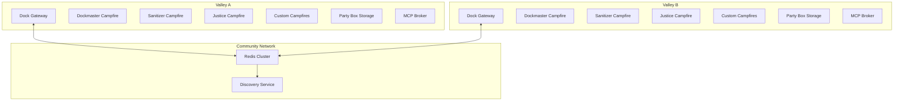
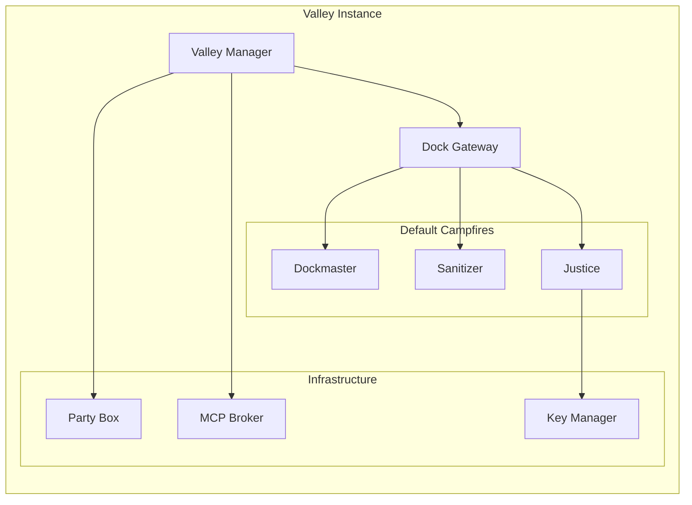

# CampfireValley Library Design Document

## Overview

CampfireValley extends the Campfires framework to create distributed, secure communities of AI agents called "valleys." Each valley operates as an autonomous node that can communicate with other valleys through standardized dock gateways, enabling collaborative AI workflows across different servers and networks.

The design leverages proven Python libraries (redis-py, cryptography, asyncio) and follows microservices patterns to ensure scalability, security, and maintainability. The river metaphor guides the communication model where "torches" (messages) travel via "riverboats" (MCP channels) between valleys through secure "docks" (gateways).

## Architecture

### High-Level Architecture



### Core Components Architecture



## Components and Interfaces

### 1. Valley Manager

**Class**: `Valley`

**Responsibilities**:
- Initialize and manage valley lifecycle
- Load configuration from manifest.yaml
- Coordinate dock, campfires, and infrastructure components
- Handle community joining/leaving operations

**Key Methods**:
```python
class Valley:
    def __init__(self, name: str, manifest_path: str = './manifest.yaml', 
                 party_box: PartyBox = None, mcp_broker: str = 'redis://localhost:6379')
    async def start(self) -> None
    async def stop(self) -> None
    async def join_community(self, community_name: str, key: str) -> bool
    async def leave_community(self, community_name: str) -> bool
    async def provision_campfire(self, campfire_config: dict) -> bool
```

**Dependencies**:
- `redis-py` for MCP broker connection
- `pydantic` for configuration validation
- `asyncio` for async operations

### 2. Dock Gateway

**Class**: `Dock`

**Responsibilities**:
- Manage inter-valley communication channels
- Route incoming/outgoing torches
- Handle discovery broadcasts
- Coordinate default campfires

**Key Methods**:
```python
class Dock:
    async def start_gateway(self) -> None
    async def handle_incoming_torch(self, torch: Torch) -> None
    async def send_torch(self, target_address: str, torch: Torch) -> bool
    async def broadcast_discovery(self) -> None
    async def validate_sender(self, torch: Torch) -> bool
```

**Communication Channels**:
- `dock:invite` - Discovery broadcasts
- `dock/incoming` - Inbound torch processing
- `dock/outgoing` - Outbound torch routing

### 3. Default Campfires

#### Dockmaster Campfire
**Campers**: Loader, Router, Packer

**Responsibilities**:
- Unpack incoming torch payloads
- Route torches to appropriate campfires
- Package outbound responses with Party Box attachments

**Key Operations**:
```python
class DockmasterCampfire:
    async def unpack_torch(self, torch: Torch) -> dict
    async def route_torch(self, torch: Torch, routing_rules: dict) -> str
    async def pack_response(self, response: dict, attachments: list) -> Torch
```

#### Sanitizer Campfire
**Campers**: Scanner, Filter

**Responsibilities**:
- Content security scanning (text, code, images)
- Malware detection using static analysis
- GDPR/legal compliance checks

**Key Operations**:
```python
class SanitizerCampfire:
    async def scan_content(self, content: dict) -> ScanResult
    async def filter_unsafe_content(self, content: dict) -> dict
    async def quarantine_flagged_content(self, content: dict) -> None
```

**Security Integrations**:
- Text filtering using regex patterns and LLM-based detection
- Image scanning via computer vision models (OpenCV integration)
- Code analysis using AST parsing and pattern matching

#### Justice Campfire
**Campers**: Sheriff, Investigator

**Responsibilities**:
- Access control and key management
- Policy enforcement and violation handling
- Community membership management

**Key Operations**:
```python
class JusticeCampfire:
    async def manage_keys(self, operation: str, valley_id: str) -> bool
    async def handle_violation(self, violation: Violation) -> Action
    async def review_quarantine(self, item_id: str) -> Decision
```

### 4. VALI (Valley Application Layer Interface)

**Purpose**: Standardized interface patterns for inter-valley services

**Core Patterns**:
```python
class VALIServiceRequest:
    service_type: str  # "backend_dev", "frontend_dev", "testing", etc.
    request_id: str
    payload: dict
    requirements: dict
    deadline: Optional[datetime]

class VALIServiceResponse:
    request_id: str
    status: str  # "completed", "in_progress", "failed"
    deliverables: dict
    metadata: dict
```

## Data Models

### Core Data Structures

```python
from pydantic import BaseModel
from typing import Optional, Dict, List
from datetime import datetime

class Torch(BaseModel):
    """Message container for inter-valley communication"""
    id: str
    sender_valley: str
    target_address: str
    payload: Dict
    attachments: List[str] = []
    signature: str
    timestamp: datetime
    
class ValleyConfig(BaseModel):
    """Valley configuration from manifest.yaml following GitHub Actions/Ansible format"""
    name: str
    version: str = "1.0"
    
    # Environment and runtime configuration
    env:
        dock_mode: str = "private"  # public, partial, private
        security_level: str = "standard"
        auto_create_dock: bool = True
    
    # Campfire definitions similar to GitHub Actions jobs
    campfires:
        visible: List[str] = []
        hidden: List[str] = []
        
    # Step-based dock configuration like Ansible tasks
    dock:
        steps: List[Dict] = []  # Sequential dock setup steps
        
    # Community and networking
    community:
        discovery: bool = False
        trusted_valleys: List[str] = []
    
class CommunityMembership(BaseModel):
    """Community membership information"""
    community_name: str
    alias: str
    key_hash: str
    joined_at: datetime
    trust_level: str = "basic"
    
class CampfireConfig(BaseModel):
    """Configuration for provisioned campfires following GitHub Actions job format"""
    name: str
    runs_on: str = "valley"  # Similar to GitHub Actions runs-on
    
    # Environment variables like GitHub Actions
    env: Dict[str, str] = {}
    
    # Strategy matrix for multiple configurations
    strategy:
        matrix: Dict = {}
        
    # Steps similar to GitHub Actions/Ansible tasks
    steps: List[Dict] = []  # Each step defines camper actions
    
    # Needs/dependencies like GitHub Actions
    needs: List[str] = []
    
    # Conditional execution
    if_condition: Optional[str] = None
    
    # Outputs for other campfires to use
    outputs: Dict[str, str] = {}
    
    # Traditional campfire settings
    rag_paths: List[str] = []
    auditor_enabled: bool = True
    channels: List[str] = []
```

### Configuration Examples

**Valley Manifest (manifest.yaml)**:
```yaml
name: "DevTeamValley"
version: "1.0"

# Environment configuration
env:
  dock_mode: "public"
  security_level: "high"
  auto_create_dock: true

# Campfire definitions (similar to GitHub Actions jobs)
campfires:
  visible: ["backend-dev", "frontend-dev", "project-manager"]
  hidden: ["internal-audit"]

# Dock setup steps (similar to Ansible tasks)
dock:
  steps:
    - name: "Initialize gateway"
      uses: "dock/gateway@v1"
      with:
        port: 6379
        encryption: true
    - name: "Setup discovery"
      uses: "dock/discovery@v1"
      if: "${{ env.dock_mode == 'public' }}"

# Community configuration
community:
  discovery: true
  trusted_valleys: ["ClientCorpValley", "TestingValley"]
```

**Campfire Configuration (backend-dev.yaml)**:
```yaml
name: "backend-developer"
runs_on: "valley"

env:
  PYTHON_VERSION: "3.12"
  FRAMEWORK: "FastAPI"

strategy:
  matrix:
    tech_stack: ["django", "fastapi", "flask"]

steps:
  - name: "Setup development environment"
    uses: "camper/loader@v1"
    with:
      rag_path: "./rag/backend_patterns"
      
  - name: "Code generation"
    uses: "camper/coder@v1"
    with:
      templates: "${{ matrix.tech_stack }}"
      
  - name: "Quality assurance"
    uses: "camper/auditor@v1"
    if: "${{ env.security_level == 'high' }}"

needs: ["project-manager"]

outputs:
  code_artifacts: "${{ steps.code-generation.outputs.files }}"
  documentation: "${{ steps.code-generation.outputs.docs }}"
```

### Storage Schema

**Party Box Structure**:
```
/party_box/
├── /incoming/
│   ├── /raw/          # Unpacked torch payloads
│   └── /processed/    # Sanitized content
├── /outgoing/
│   ├── /pending/      # Queued responses
│   └── /sent/         # Delivery confirmations
├── /quarantine/       # Flagged content
└── /attachments/      # Large file storage
```

**Security Storage**:
```
/.secrets/
├── valley_links.json     # Encrypted community keys
├── private_key.pem       # Valley's private key
└── certificates/         # TLS certificates
```

## Error Handling

### Error Categories

1. **Communication Errors**
   - Network timeouts
   - Redis connection failures
   - Invalid torch formats

2. **Security Errors**
   - Authentication failures
   - Content policy violations
   - Encryption/decryption errors

3. **Configuration Errors**
   - Invalid manifest.yaml
   - Missing campfire configurations
   - Incompatible VALI versions

### Error Handling Strategy

```python
class ValleyError(Exception):
    """Base exception for valley operations"""
    pass

class CommunicationError(ValleyError):
    """Network and messaging errors"""
    pass

class SecurityError(ValleyError):
    """Security and authentication errors"""
    pass

class ConfigurationError(ValleyError):
    """Configuration and setup errors"""
    pass

# Error handling with exponential backoff
async def retry_with_backoff(operation, max_retries=3):
    for attempt in range(max_retries):
        try:
            return await operation()
        except CommunicationError as e:
            if attempt == max_retries - 1:
                raise
            await asyncio.sleep(2 ** attempt)
```

## Testing Strategy

### Unit Testing
- **Component Tests**: Individual campfire functionality
- **Integration Tests**: Dock gateway operations
- **Security Tests**: Encryption/decryption, key management
- **Configuration Tests**: Manifest loading and validation

### Integration Testing
- **Multi-Valley Simulation**: Docker Compose setup with 2-3 valleys
- **Community Formation**: Valley discovery and joining workflows
- **Service Exchange**: VALI-based development team scenarios
- **Failure Recovery**: Network partitions, Redis failures

### Demo Examples

#### 1. Development Services Valley
```python
# Specialist valley with development team campfires
specialist_valley = Valley("DevTeam", "./configs/dev_team_manifest.yaml")

# Campfires for each specialist
backend_dev = BackendDeveloperCampfire()
frontend_dev = FrontendDeveloperCampfire()
project_manager = ProjectManagerCampfire()
devops_dev = DevOpsDeveloperCampfire()
testing_dev = TestingDeveloperCampfire()
```

#### 2. Client Valley Requesting Services
```python
# Client valley requesting development services
client_valley = Valley("ClientCorp", "./configs/client_manifest.yaml")

# Service request via VALI
service_request = VALIServiceRequest(
    service_type="full_stack_development",
    payload={
        "project_description": "E-commerce platform",
        "tech_stack": ["Python", "React", "PostgreSQL"],
        "timeline": "4 weeks"
    }
)

# Send request through dock
await client_valley.dock.send_torch(
    "valley:DevTeam/project_manager", 
    Torch.from_vali_request(service_request)
)
```

### Performance Testing
- **Throughput**: Torch processing rates (target: 100 torches/second)
- **Latency**: Inter-valley communication delays (target: <100ms local, <500ms remote)
- **Scalability**: Community size limits (target: 100 valleys)
- **Resource Usage**: Memory and CPU consumption under load

### Security Testing
- **Penetration Testing**: Attempt unauthorized valley access
- **Content Filtering**: Verify sanitizer effectiveness
- **Key Rotation**: Test periodic key updates
- **Audit Trails**: Verify complete operation logging

## Implementation Notes

### Technology Stack
- **Python 3.12+**: Core runtime
- **redis-py**: MCP broker and pub/sub
- **cryptography**: Encryption and key management
- **pydantic**: Data validation and serialization
- **asyncio**: Asynchronous operations
- **PyYAML**: Configuration file parsing
- **FastAPI**: Optional debug/admin interface

### Deployment Considerations
- **Docker Support**: Containerized valley deployments
- **Redis Clustering**: High-availability message broker
- **TLS Configuration**: Encrypted inter-valley communication
- **Monitoring**: Prometheus metrics and logging integration
- **Backup Strategy**: Party Box and key storage backup

### Extension Points
- **Custom Campfires**: Plugin architecture for specialized services
- **VALI Extensions**: New service patterns and protocols
- **Security Modules**: Additional content filters and scanners
- **Storage Backends**: Alternative Party Box implementations